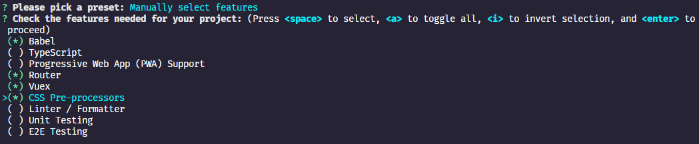
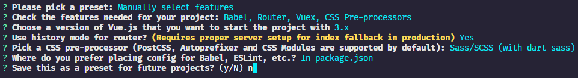
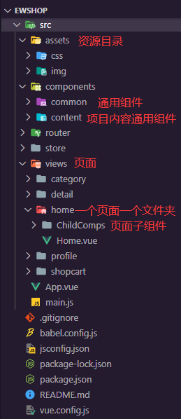

# ewshop

## 运行项目

* 安装依赖：

```
npm install
```

* 开启服务：

```
npm run serve
```

* 打包项目：

```
npm run build
```

## 项目简介

#### 1. 技术方向：

**Vue3** + **Vuex** + **VueRouter** + **Composition AIP** + **Vant** 组件库

#### 2. 系统环境：

* Node.js v14.17.6.
* npm 6.14.15
* webpack-cli 4.1.0
* webpack 5.3.2
* @vue/cli 5.0.6

#### 3. 项目 AIP 接口地址：

[ewshop 项目接口地址：https://www.showdoc.com.cn/1207745568269674/6090123481636428](https://www.showdoc.com.cn/1207745568269674/6090123481636428)

#### 4. 项目原作者：


[原项目作者 IT峰播的个人空间_哔哩哔哩_bilibili：https://space.bilibili.com/483963826](https://space.bilibili.com/483963826)


[原项目视频地址：https://www.bilibili.com/video/BV1Pz4y1S7Uv](https://www.bilibili.com/video/BV1Pz4y1S7Uv)

## 创建项目

### 1. 创建 ewshop 项目：

#### 1. @vue/cli 创建项目：

```
vue create ewshop
```

* 选择 Manually select features 手动创建项目

#### 2. 选择项目插件：



#### 3. 项目配置：



### 2. Git 管理项目：

1. GitHub 创建 ewshop 项目仓库。
2. 在本地 ewshop 目录中初始化 Git 本地仓库（在 ewshop 中生成 **.git** 目录）：

```
git init
```

3. 将本地 ewshop 项目推送到 GitHub ewshop 中：

```
git remote add origin git@github.com:GitHub名称/项目仓库名称.git
git branch -M main

git add .
git commit -m "GitHub init"

git push -u origin main
```

### 3. GitHub 稳定访问方法：

* FastGithub

[FastGithub 软件下载地址：https://github.com/dotnetcore/fastgithub/releases](https://github.com/dotnetcore/fastgithub/releases)

[FastGithub 项目地址：https://github.com/dotnetcore/FastGithub](https://github.com/dotnetcore/FastGithub)

## 初始化项目：

#### 1. 项目结构：



#### 2. 设置目录别名：

在 **vue.config.js** 中添加 webpack 项目别名配置：

```javascript
const { defineConfig } = require('@vue/cli-service')
module.exports = defineConfig({
  transpileDependencies: true,
  configureWebpack: { // webpack 配置
    resolve: {
      alias: { // 为目录设置别名
        '@assets': '@/assets', // @assets = src/assets
        '@components': '@/components', // @components = src/components
        '@network': '@/network', // @network = src/network
        '@utils': '@/utils', // @utils = src/utils
        '@views': '@/views', // @views = src/views
      }
    }
  },
})

```

* 如果你是在 vsCode 中，那么需要配置 **jsconfig.js** 才能准确提示路径：

[vue项目构建之jsconfig.json作用_小渣亮的博客-CSDN博客_jsconfig.js：https://blog.csdn.net/weixin_43845137/article/details/122952997](https://blog.csdn.net/weixin_43845137/article/details/122952997)

#### 3. 设置全局样式：

1. 添加初始化公共样式：

使用 GitHub 的 normalize.css：

[necolas/normalize.css: A modern alternative to CSS resets (github.com)](https://github.com/necolas/normalize.css)

2. 添加自己的全局样式：

在 **src/assets/css** 中新建 **base.css** 并引入 normalize.css：

```javascript
@import "./normalize.css"; /* 引入初始化公共样式 */

:root {
  --color-text: #666;
  --color-high-text: #42bbaa;
  --color-tint: #42b983;
  --color-background: #fff;
  --font-size: 14px;
  --line-height: 1.5;
}

*,
*::before,
*::after {
  margin: 0;
  padding: 0;
  box-sizing: border-box;
}

body {
  user-select: none; /* 禁止用户选中文字或图片 */
  background-color: var(--color-background);
  color: var(--color-text);
  width: 100vw;
}

a {
  color: var(--color-text);
  text-decoration: none;
}
```

3. 在 **main.js** 中引入 css：

```javascript
import '@assets/css/base.css'; // 添加全局公共样式
```

#### 4. Axios 简单封装：


