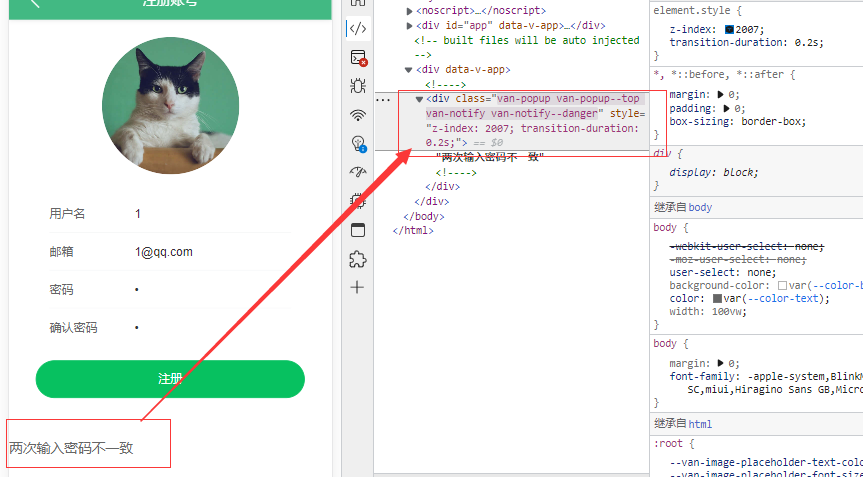
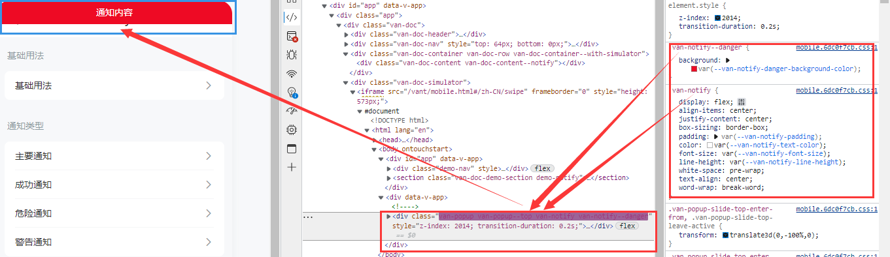

[](https://www.oscs1024.com/project/ruoxijun/ewshop?ref=badge_small)

# ewshop

## 运行项目

* 安装依赖：

```
npm install
```

* 开启服务：

```
npm run serve
```

* 打包项目：

```
npm run build
```

## 项目简介

#### 1. 技术方向：

**Vue3** + **Vuex** + **VueRouter** + **Composition AIP** + **Vant** 组件库

#### 2. 系统环境：

* Node.js v14.17.6.
* npm 6.14.15
* webpack-cli 4.1.0
* webpack 5.3.2
* @vue/cli 5.0.6

#### 3. 项目 AIP 接口地址：

[ewshop 项目接口地址：https://www.showdoc.com.cn/1207745568269674/6090123481636428](https://www.showdoc.com.cn/1207745568269674/6090123481636428)

#### 4. 项目原作者：


[原项目作者 IT峰播的个人空间_哔哩哔哩_bilibili：https://space.bilibili.com/483963826](https://space.bilibili.com/483963826)


[原项目视频地址：https://www.bilibili.com/video/BV1Pz4y1S7Uv](https://www.bilibili.com/video/BV1Pz4y1S7Uv)

## 创建项目

### 1. 创建 ewshop 项目：

#### 1. @vue/cli 创建项目：

```
vue create ewshop
```

* 选择 Manually select features 手动创建项目

#### 2. 选择项目插件：


#### 3. 项目配置：


### 2. Git 管理项目：

1. GitHub 创建 ewshop 项目仓库。
2. 在本地 ewshop 目录中初始化 Git 本地仓库（在 ewshop 中生成 **.git** 目录）：

```
git init
```

3. 将本地 ewshop 项目推送到 GitHub ewshop 中：

```
git remote add origin git@github.com:GitHub名称/项目仓库名称.git
git branch -M main

git add .
git commit -m "GitHub init"

git push -u origin main
```

### 3. GitHub 稳定访问方法：

* FastGithub

[FastGithub 软件下载地址：https://github.com/dotnetcore/fastgithub/releases](https://github.com/dotnetcore/fastgithub/releases)

[FastGithub 项目地址：https://github.com/dotnetcore/FastGithub](https://github.com/dotnetcore/FastGithub)

## 初始化项目：

#### 1. 项目结构：


#### 2. 设置目录别名：

在 **vue.config.js** 中添加 webpack 项目别名配置：

```javascript
const { defineConfig } = require('@vue/cli-service')
module.exports = defineConfig({
  transpileDependencies: true,
  configureWebpack: { // webpack 配置
    resolve: {
      alias: { // 为目录设置别名
        '@assets': '@/assets', // @assets = src/assets
        '@components': '@/components', // @components = src/components
        '@network': '@/network', // @network = src/network
        '@utils': '@/utils', // @utils = src/utils
        '@views': '@/views', // @views = src/views
      }
    }
  },
})

```

* 如果你是在 vsCode 中，那么需要配置 **jsconfig.js** 才能准确**提示路径**：

[vue项目构建之jsconfig.json作用_小渣亮的博客-CSDN博客_jsconfig.js：https://blog.csdn.net/weixin_43845137/article/details/122952997](https://blog.csdn.net/weixin_43845137/article/details/122952997)

#### 3. 设置全局样式：

1. 添加初始化公共样式：

使用 GitHub 的 normalize.css：

[necolas/normalize.css: A modern alternative to CSS resets (github.com)](https://github.com/necolas/normalize.css)

2. 添加自己的全局样式：

在 **src/assets/css** 中新建 **base.css** 并引入 normalize.css：

```javascript
@import "./normalize.css"; /* 引入初始化公共样式 */

:root {
  --color-text: #666;
  --color-high-text: #42bbaa;
  --color-tint: #42b983;
  --color-background: #fff;
  --font-size: 14px;
  --line-height: 1.5;
}

*,
*::before,
*::after {
  margin: 0;
  padding: 0;
  box-sizing: border-box;
}

body {
  user-select: none; /* 禁止用户选中文字或图片 */
  background-color: var(--color-background);
  color: var(--color-text);
  width: 100vw;
}

a {
  color: var(--color-text);
  text-decoration: none;
}
```

3. 在 **main.js** 中引入 css：

```javascript
import '@assets/css/base.css'; // 添加全局公共样式
```

#### 4. Axios 简单封装：

1. 在 network/request.js 中：

```javascript
import axios from 'axios' // 引入 axios

export function request(config) {
  const instance = axios.create({
    baseURL: 'https://api.shop.eduwork.cn/',
    timeout: 5000,
  });

  // 请求拦截器
  instance.interceptors.request.use(config=>{
    // 暂时直接放行
    return config;
  }, err=>{

  });

  // 响应拦截器
  instance.interceptors.response.use(res=>{
    return res.data || res;
  }, err=>{

  });

  // 这里相当于返回了 Axios(config)
  return instance(config);
}
```

2. 在 network/home.js 中：

```javascript
import { request } from "./request"; // 引入

export function getHomeAllData() {
  return request({
    url: 'api/index',
    method: 'GET',
  });
}
```

3. Home.vue 中测试：

```javascript
import { onMounted } from "vue";
import { getHomeAllData } from "@network/home";
export default {
setup() {
  onMounted(()=> {
    getHomeAllData().then(res=> {
      console.log(res);
    }).catch(err=> {
      console.log(err);
    });
  });
},
}
```

#### 5. 添加阿里图标库：

[iconfont-阿里巴巴矢量图标库：https://www.iconfont.cn/](https://www.iconfont.cn/)

在阿里巴巴矢量图标库网站中选取自己心仪的图标添加至购物车，最后在购物车中选择 **下载代码**。将解压后的 **iconfont.css** 文件添加到 **src\assets\css\iconfont\ ** 文件夹中。

1. 在 **main.js** 中将 **iconfont.css** 引入项目（也可在 base.css 中引入）：

```javascript
import '@assets/css/iconfont/iconfont.css'; // 引入阿里图标
```

2. 使用图标：

在下载解压的文件中 **demo_index.html** 选择 **Font class** 在最下面有使用方法介绍。

```html
<!-- 标签可以随意，icon-xxx 具体图标类名在图标下方有显示 -->
<span class="iconfont icon-xxx"></span>
```

## 项目过程：

### 1. BetterScroll 上拉加载：

* [better-scroll github.com 地址：https://github.com/ustbhuangyi/better-scroll](https://github.com/ustbhuangyi/better-scroll)

1. 安装 BetterScroll：

```
npm install @better-scroll/core # 核心滚动，大部分情况可能只需要一个简单的滚动
```

2. 在 Home.vue 中引入 BetterScroll ：

```javascript
import BetterScroll from 'better-scroll';
```

3. onMounted 中创建 BetterScroll 实例并实现上拉加载：

```javascript
// 选项卡内容滚动
bs = new BetterScroll(wrapper.value, {
    click: true, // 内容区域点击是否生效
    pullUpLoad: true, // 开启上拉加载更多
    probeType: 3, // 触发滚动事件模式 1：懒惰、2：实时、3：敏感
});
// 滚动监听
bs.on('scroll', position=> {});
// 上拉到底部监听
bs.on('pullingUp', ()=> {
    bs.refresh(); // 刷新需要滚动的内容区域高度
    // 上拉到底部时请求下一页数据
    getHomeGoods(currentType.value, ++goods.page).then(res=> {
        let data = res.goods.data;
        // 防止页数不停自增
        goods.page = data.length ? res.goods.current_page : --res.goods.current_page;
        // 新数据拼接到之前的数据当中
        goods.list.push(...data);
        // 上拉刷新成功后必须让新数据展示出来并刷新内容区域高度
        bs.finishPullUp();
        bs.refresh();
    }).catch(err=> {
        console.log(err);
    });
});
```

* html：

```html
<div ref="wrapper" class="wrapper">
    <div class="content">
        ...
```

#### 关键点：

* 一般 UI 中自带上（下）拉加载（刷新）的组件不建议使用 BetterScroll （**是真的糟心**）。
* 刚开始使用的 `import BScroll from '@better-scroll/core'` 滚都不能滚，应该是少了啥插件之后换成 `import BetterScroll from 'better-scroll'` 有了一点滚动效果。
* 之所以不能完全滚动是因为 `.content` 中的内容还没有加载完成（Dom 的加载和图片加载未完成），BetterScroll 把未加载完成的内容高度作为滚动高度，导致能滚动的距离只有一点点甚至没有。
* 在 `pullingUp` 监听中添加 `bs.refresh()` 来刷新内容区域高度解决滚动不完全和不准确问题（不在 `scroll` 中使用是因为太频繁，且不好用）。
* 上拉加载新数据后需要 `bs.finishPullUp()` 。
* [建议使用 Vant List 列表：https://vant-contrib.gitee.io/vant/#/zh-CN/list](https://vant-contrib.gitee.io/vant/#/zh-CN/list)

#### 遇到问题：

* 选项卡 `position: sticky;` 失效，导致选项栏目不能实现吸附到顶部而随内容滚动。
* 原因： `BetterScroll` 滚动功能给内容元素添加了 `transform` 样式导致 `sticky` 元素形成类似 `absolute` 的效果。
* 解决方法： 在 BetterScroll 元素外添加同类型选项卡元素定位到吸附位置，添加滚动监听在选项卡滚动到响应位置时显示在 BetterScroll 外的选项卡元素。

### 2. 使用 Vant UI：

#### 1. Vant 官网：

[youzan/vant: Lightweight Mobile UI Components built on Vue (github.com)](https://github.com/youzan/vant)

[Vant 3 - 轻量、可靠的移动端组件库 (gitee.io)](https://vant-contrib.gitee.io/vant/#/zh-CN)

#### 2. 基础使用：

##### 1. 安装：

```
npm i vant
```

##### 2. 按需引入:

* 推荐安装 [unplugin-vue-components](https://github.com/antfu/unplugin-vue-components) 插件，它可以自动按需引入组件

```
npm i unplugin-vue-components -D
```

* `vue-cli` 的项目，在 `vue.config.js` 文件中配置插件：

```javascript
const { VantResolver } = require('unplugin-vue-components/resolvers');
const ComponentsPlugin = require('unplugin-vue-components/webpack');

module.exports = {
  configureWebpack: {
    plugins: [
      ComponentsPlugin({
        resolvers: [VantResolver()],
      }),
    ],
  },
};
```

* **main.js** 中引入要使用的组件：

```javascript
// 引入 Vant 录播图 组件
import { Swipe, SwipeItem } from 'vant';
// 安装 Vant 轮播图 组件
createApp(App) .use(Swipe).use(SwipeItem) .mount('#app')
```

#### 3. van-list 上拉加载遇坑：

##### 1. van-list 使用方式：

[List 列表 - Vant 3 (gitee.io)：https://vant-contrib.gitee.io/vant/#/zh-CN/list](https://vant-contrib.gitee.io/vant/#/zh-CN/list)

##### 2. van-list 知识点：

###### props:

* loading： 属性表示 list 数据是否在加载中状态，如果为 true 那么 load（上拉加载） 方法将不会被触发。
* finished： 属性表示 list 所有的数据是否已加载完毕，如果为 true 将会在触发 load 事件。

* immediate-check： 初始化时检查滚动位置，当满足 `offset` 属性时立即执行一次 load 方法。

###### Events：

* load： 当满足 `offset` 属性时且 loading、finished 都为 false 执行上拉加载方法。

###### 组件实例方法：

* check： 检查当前的滚动位置，若已滚动至底部，则会触发 load 事件。

##### 3. 问题：

```javascript
// 侧边栏目或者选项卡点击改变时
const sidOrTabChange = id=> {
    goods.list.splice(0); // 清空数组
    if(id) sidebarId.value !== id?sidebarId.value = id : null; // 左侧选中栏目的 id
    goods.page = 0; // 重置页数
    finished.value = false; // 表示需要加载新数据
}
```

###### 问题描述：

在选项卡或者侧边栏被点击后会 **清空** **van-list** 商品列表即数组，当我从一页完整的数据中切换到其它列表中时，van-list 展示空白且不能上拉加载等操作。

###### 探究原因：

当一页数据加载并渲染完成后（列表高度大于容器高度），默认需要我们 **滚动** 到 offset 设置的距离才能执行 load 方法。

而清空数组后 Dom 并没有立即渲染（高度不满足条件）完成导致 `finished.value = false` 没有起到执行 load 的效果，因此我们需要在 Dom 执行 load 或者不使用 load 自行请求一次数据加载列表。

###### 解决办法：

1. 方案 1 使用 nextTick：

关键 html：

```html
<van-list
          ref="goodsList"
          :loading="loading"
          :finished="finished"
          finished-text="没有更多了"
          :error="error"
          error-text="请求失败，点击重新加载"
          @load="onLoadGoodsList"
        >
```


关键 js：

```javascript
const sidOrTabChange = id=> {
    // loading.value = true; // 数据加载中（load 无法执行）
    finished.value = false; // 表示需要加载新数据
    goods.list.splice(0); // 清空数组
    if(id) sidebarId.value !== id?sidebarId.value = id : null; // 左侧选中栏目的 id
    goods.page = 0; // 重置页数

    /**
     * 因为我们清空了数组但是此时 Dom 可能还没有更新，如果此时 finished 直接设置为 false
     * 会导致 onLoadGoodsList 无法执行。
     * 在数据更新后 nextTick 能在 Dom 渲染完成后自动调用。
     *
     * 此外官方还提供了 check（推荐使用） 方法结合 ref 使用来触发 load
     */
    nextTick(()=> {
        goodsList.value.check(); // 触发 load
        // loading.value = false; // 表示数据已加载完成，load 方法能够执行
    });
}
```

2. 方案 2 在 sidOrTabChange 自行请求一页数据添加到 goods.list。

#### 4. van-swipe 滑动轮播图导致触发 click：

当我手动滑动 Vant 轮播图时，会触发轮播图里的点击事件。解决方案：

```html
<!-- stop-propagation 设置为 false 可避免 -->
<van-swipe class="swipe"
           :autoplay="3000"
           indicator-color="white"
           :stop-propagation="false"
           >
```

参考：[vant 滑动轮播时为什么触发了 click 事件 ：https://blog.csdn.net/weixin_42178050/article/details/104846365](https://blog.csdn.net/weixin_42178050/article/details/104846365)

#### 5. Notify 消息通知样式失效：

##### 1. 使用 Notify 消息通知时样式失效，官方文档 Notify 章节中表示直接引入 Notify 即可直接使用。如下：

```javascript
import { Notify } from 'vant';

Notify('通知内容');
```

效果图：



##### 2. 问题排查：

对比官方样式效果图：



比较官方可以看得出我缺少了 **`.van-notify`** 等样式，证明 Notify 的样式没有被我们引入。

##### 3. 解决方案：

在官方的快速上手文档中提到：

* Vant 中有个别组件是以函数的形式提供的，包括 `Toast`，`Dialog`，`Notify` 和 `ImagePreview` 组件。在使用函数组件时，`unplugin-vue-components` 无法自动引入对应的样式，因此需要手动引入样式。

[快速上手 - Vant 3 (gitee.io) https://vant-contrib.gitee.io/vant/#/zh-CN/quickstart#4.-yin-ru-han-shu-zu-jian-de-yang-shi](https://vant-contrib.gitee.io/vant/#/zh-CN/quickstart#4.-yin-ru-han-shu-zu-jian-de-yang-shi)

```javascript
// Notify
import { Notify } from 'vant';
import 'vant/es/notify/style';
```

因为很多地方要用到 Notify 我将 `import 'vant/es/notify/style';` 放在了 **main.js** 。

#### 6. Object.keys(obj)：

```
obj= {
    name: 'haha',
    age: 18,
}
// 将对象的所有属性 key 组成数组返回
Object.keys(obj); // ['name', 'age']
```


